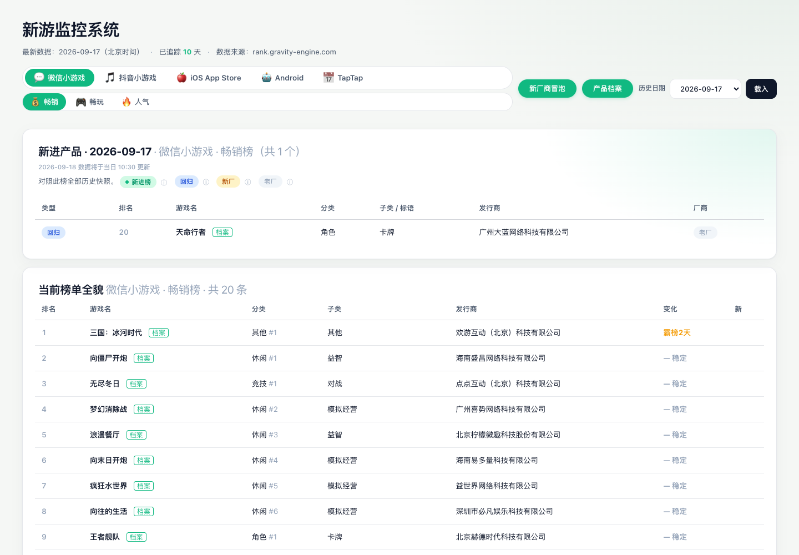

<p align="center">
  
</p>

<p align="center">
  <a href="https://miracle-shen.github.io/minigame-rank-daily/">[在线仪表盘]</a> •
  <a href="#weekly">[周报]</a> •
  <a href="#detail">[产品档案]</a> •
  <a href="#quick-start">[快速开始]</a> •
  <a href="#push">[推送通道]</a> •
  <a href="https://github.com/Miracle-Shen/minigame-rank-daily">[源码]</a>
</p>

**minigame-rank-daily** 每天北京时间 10:30 自动抓取微信小游戏 / 抖音小游戏的 6 个榜单，叠加 TapTap 预约榜、**iOS 美 / 国 / 日区**与 **Android 美区**免费榜，与累积 base 库比对算出每条榜单的「新进榜 / 回归 / 新发行商」，发布成一面纯静态仪表盘；每周一 09:00 再产出一份微信小游戏周报，自动推送到企业微信群。

<table>
  <tr>
    <th>微信小游戏</th>
    <th>抖音小游戏</th>
    <th>TapTap</th>
    <th>iOS App Store</th>
    <th>Android</th>
  </tr>
  <tr>
    <td align="center">畅销榜<br>畅玩榜<br>人气榜</td>
    <td align="center">畅销榜<br>热门榜<br>新游榜</td>
    <td align="center">预约榜</td>
    <td align="center">美区免费榜<br>国区免费榜<br>日区免费榜</td>
    <td align="center">美区免费榜</td>
  </tr>
</table>

> **抓取方式**：引力引擎两个平台的数据走的是站点公开接口（`scripts/scrape_gravity_http.py`，
> 纯 HTTP，不需要浏览器和登录态）。此前用 Playwright 渲染页面，实测会因 SPA 加载失败
> （`ERR_CONNECTION_CLOSED`）导致当天微信 / 抖音数据整块缺失，因此改为接口直连作为主路径，
> 浏览器渲染保留为兜底。

- **抓取**：GitHub Actions 每日北京时间 10:30 触发（榜单 10:00 更新，留 30 分钟让后端稳定）
- **存储**：每天一份 JSON 进 `data/daily/`，diff 进 `data/diff/`，cumulative base 进 `data/base/`，趋势进 `data/history.jsonl`
- **展示**：纯静态页（`site/`）通过 GitHub Pages 发布

## 📢 更新记录

- **2026.09.21** — 「游戏周热榜」卡片三处调整：**「本周变化」改为与周报「1.3 本周新变量」同一写法**（点名新晋者 + 显著上升者，各列前 3 个、上升带位次增量）；尾注去掉「查看图文周报」，只留数据主页；品类涨退的 `+10pp` 写成「占比 +10 个百分点」（pp 是行话，业务侧会读成「涨了 10%」）。
- **2026.09.21** — 目标群收敛为**固定 2 个**（「我和机器人们」+「web三组外网问题跟进群」）：CI 侧 Secret 为 `WECOM_CHATID` / `WECOM_CHATID_2`（多余的 `_3` 已删）；方式 B 直发同样支持多群（`WECOM_GROUP_ID` / `_2`，`--group-id` 可重复），两侧目标一致、合并去重后逐群发送。
- **2026.09.21** — 群机器人推送支持**多群投递**：`WECOM_CHATID` 内可用逗号拼多个 ID，或另开 `WECOM_CHATID_2` / `_3`（读到自动合并去重），同一份内容按 `chatid` 逐条发，某个群失败不影响其它群；`--chatid` 改为可重复。CI 侧 `weekly.yml` / `push-test.yml` 已透传 `_2` / `_3`。
- **2026.09.20** — 新增**「游戏周热榜」群消息卡片**（`scripts/monitor/hotlist.py`）：群里只发一屏——微信前三 / 抖音前三（· 游戏名-品类-周环比趋势 + 一行复刻建议）/ 🔥全平台 TOP1 + 一句话本周趋势 + 数据主页；`--card` 切换，周报正文不受影响。
- **2026.09.20** — 群机器人推送支持 **`chatid` 定向投递**：机器人被加进多个群时，不再一律群发，可用 `WECOM_CHATID` / `--chatid` 锁定单个群（该字段官方文档未写，实测有效且会校验群归属）。
- **2026.09.20** — 移除邮件投递通道，周报推送收敛为**企业微信群**单一形态（方式 A：群机器人 Webhook 跑在 CI / 方式 B：机器人直发跑在本机），投递脚本由 `send_mail.py` 收缩为 `send_wecom.py`。
- **2026.09.16** — 产品档案新增第 5 分区「结合业务的建议」：**424 法则**（为什么 / 怎么做 / 收益），其中「为什么」按**用户视角 2 条 + 业务视角 2 条**双视角写；184 款全量回填。
- **2026.09.15** — 产品档案上线：当日各榜 TOP20 并集 **152/152** 全部建档（索引 184 条），含技术实现 / 核心玩法 / 官方截图 / 复刻建议四分区，并提供逐款详情页。
- **2026.09.14** — 抓取主路径改为引力引擎公开接口（纯 HTTP，不再依赖浏览器渲染）；接入周报分析层与**企业微信群机器人**推送，产出首份周报 `reports/weekly-2026-09-14.*`。

## 🗂️ 仓库结构

```
.
├── scripts/
│   ├── scrape_gravity_http.py 引力引擎公开接口抓取（纯 HTTP，主抓取路径）
│   ├── scrape_rank.py    浏览器渲染抓取 / 解析（兜底路径，与桌面端共用）
│   ├── scrape_taptap.py  TapTap 预约榜（SSR JSON-LD，纯 stdlib）
│   ├── scrape_ios.py     iOS 美 / 国 / 日区游戏免费榜（Apple iTunes RSS，纯 stdlib）
│   ├── scrape_googleplay.py  Android 美区免费游戏榜（AppBrain SSR，纯 stdlib）
│   ├── ci_scrape.py      CI 抓取入口，写 daily/<日期>.json 等
│   ├── base.py           累积 base 库（历史所有游戏 / 发行商）
│   ├── ci_diff.py        基于 base 分类今日新进
│   ├── ci_sync_supabase.py  快照同步到 Supabase（仪表盘的数据源）
│   ├── detail/           产品档案管线（见「产品档案」一节）
│   └── monitor/          周报分析层（classify 品类归一化 / analyze 指标 / clone 值得复刻清单 / report 渲染 / send_wecom 群机器人 Webhook / send_group 机器人直发群）
├── data/
│   ├── daily/            历史快照（每天一份）
│   ├── diff/             每天的「新进」分类
│   ├── base/             累积 base：games.json + publishers.json
│   ├── detail/           产品档案：index.json + <slug>.json（中间产物不上线）
│   ├── latest.json       最新快照（前端默认加载）
│   ├── history.jsonl     每日条数趋势
│   └── index.json        由 Pages workflow 生成的可用日期列表
├── reports/              周报产出：weekly-<日期>.md / .html / .json
├── site/                 Pages 站点
│   ├── index.html        仪表盘（新进榜 / 当前榜单全貌）
│   ├── publishers.html   新厂商冒泡
│   ├── game.html         产品档案列表 + 详情页
│   ├── style.css
│   └── app.js · publishers.js · game-detail.js · game-profile.js · sb.js · config.js
├── docs/assets/          README 使用的截图
├── supabase/             数据库迁移与 Edge Function（save-profile）
├── .github/workflows/
│   ├── daily.yml         定时抓取 + 写数据
│   ├── weekly.yml        每周一 09:00 出周报
│   ├── push-test.yml     推送通道自检
│   └── pages.yml         发布站点
└── README.md
```

<a name="quick-start"></a>

## 🚀 快速开始（第一次部署）

### 1. 把这个项目推到你自己的 GitHub

```bash
cd minigame-rank-daily
git init
git add .
git commit -m "init"
git branch -M main
git remote add origin https://github.com/<你的用户名>/minigame-rank-daily.git
git push -u origin main
```

仓库设为 **Public**（公开），否则 Pages 免费额度会受限、Actions 配额也会减半。

### 2. 准备登录态（可选，默认不需要）

**当前配置走匿名公开接口，不需要配置任何 Secret。** 引力引擎的公开接口在未登录
状态下稳定返回每榜 TOP20，且不依赖会过期的凭证 —— 对长期无人值守的定时任务是
最稳的路径。

如果将来确实需要 TOP100（例如要做全量腰部分析），再配置登录态：

1. 在本机登录 `rank.gravity-engine.com`，导出 Playwright 的 storage_state 存为 `rank_auth.json`
2. 到 GitHub 仓库 → Settings → Secrets and variables → Actions → New repository secret
3. Name 填 `GRAVITY_AUTH`，Value 粘贴上一步 JSON 的全文

> **登录态有效期**：通常几天到几周，失效后 Action 自动回落到匿名 TOP20。
> 这份维护成本对无人值守任务来说往往不划算，因此默认不启用。

### 3. 启用 GitHub Pages

仓库 → Settings → Pages：

- Source 选 **GitHub Actions**

第一次推送后，`pages.yml` 会自动构建并发布。访问：

```
https://<你的用户名>.github.io/minigame-rank-daily/
```

### 4. 第一次试跑

仓库 → Actions → 「Daily Rank Snapshot」 → Run workflow（手动触发一次，不用等 10:30）。

跑完后：

- `data/daily/<日期>.json` 会被 commit
- `data/latest.json` 同步更新
- 几分钟后 Pages 会重新部署，刷新页面就能看到数据

## ⏰ 每天发生什么

```
10:30 北京时间 (= UTC 02:30)   ┐
11:30 北京时间 (= UTC 03:30)   ┘ 双触发，防 GitHub schedule 偶发静默跳过
  ├─ daily.yml 触发
  │   ├─ pip install playwright openpyxl pycryptodome
  │   ├─ playwright install chromium
  │   ├─ python scripts/ci_scrape.py
  │   │     输出 data/daily/YYYY-MM-DD.json
  │   │     更新 data/latest.json
  │   │     追加 data/history.jsonl
  │   ├─ python scripts/ci_diff.py
  │   │     输出 data/diff/YYYY-MM-DD.json
  │   ├─ python scripts/ci_sync_supabase.py   （未配置 Supabase 时自动跳过）
  │   └─ git commit & push (作者: github-actions[bot])
  │
  └─ data/ 变化触发 pages.yml
      └─ 站点重新构建并发布
```

> 双触发是刻意的：第一次成功后第二次抓到的数据一样，`git commit` 会直接跳过，无副作用。

## 🧮 「新进榜」是怎么算出来的

这个项目维护一个**累积 base 库**（`data/base/games.json` + `publishers.json`），记录历史上所有抓到过的游戏 / 发行商，包括它们各自出现过的榜单和首次 / 末次出现的日期。

每天抓取后，把当日榜单和 base 对比，每条数据按“对**这个榜**而言”分两类：

| 类别 | 定义 |
| --- | --- |
| **新进榜** (new_to_board) | 这个游戏在**这个榜**的历史里从未出现过（不管它有没有出现在别的榜） |
| **回归** (returning) | 这个榜以前出现过、消失过、又回来（gap ≥ 2 天） |

发行商的“新进”独立计算：**首次出现在这个榜的发行商**。

> base 库内部还会区分“全新（任何榜都没见过）”和“首次入此榜（其他榜见过）”，但前端按“新进榜”统一展示——做单榜监控时这两者意义相同。要做跨榜分析的话可以直接读 `data/base/`。

base 库可以从 `data/daily/*.json` 完整重建（`base.py:rebuild_from_daily()`），所以即使 base 文件丢失也能恢复。每天 `ci_diff.py` 会先用历史 daily 重建一次 base 来保证准确性。

<a name="detail"></a>

## 🖼️ 产品档案（`scripts/detail/`）

站点第二块内容是**产品档案**：给每款在榜游戏建一份详情页，回答“这款游戏技术上怎么做的、值不值得抄、能不能和我们手里的业务发生关系”。

**覆盖口径**：**当日各榜 TOP20 的并集**（约 150 款/天），不是站点列表里的全部历史产品
（Supabase `games` 有 3200+ 款，列表里大量行显示「未建档」是预期）。

**五个分区**：

1. 技术实现细节 · 2. 核心玩法 · 爽点 · 创新点 · 3. 游戏截图 · 4. 复刻建议 · 5. **结合业务的建议**

第 5 分区与「复刻建议」是**并行**的两个决策视角：`clone` 答「要不要抄」，`biz` 答「不管抄不抄，能和我们手里的业务发生什么关系」。**一主两附**：

| 键 | 权重 | 结构 | 结论枚举 |
| --- | --- | --- | --- |
| `biz.internal` | **主体** | `why` 4 条 · `how` 2 条 · `gain` 4 条（**424 法则**：为什么 / 怎么做 / 收益） | 可复用 / 需改造 / 不建议搬 |
| `biz.opportunity` | 附属 | `points` ≤2 条一句式 | 推荐接触 / 可观望 / 不建议接触 |
| `biz.extension` | 附属 | `scenes` 1–2 个 `{scene, how}` | 无枚举 |

其中 `why` 的 4 条是**用户视角 2 条 + 业务视角 2 条**（写 `{"lens": "用户"|"业务", "text": "..."}`）——
只写业务侧会变成“对我们顺手”的建议、不回答用户买不买单；只写用户侧又回答不了该不该投入。
页面把视角渲染成小标签（用户 = 天蓝、业务 = 紫）。

口径约束：**通用口径**，不绑定具体业务线，写具体产品时用「若自有产品线含 XX 品类」条件句。

### 日常增量流程（幂等，已有档案自动跳过）

```bash
python scripts/detail/build_worklist.py      # 对齐当日榜单 -> _worklist.json
python scripts/detail/enrich_media.py        # iTunes 图标 / 实机截图 / 包体（跨次合并缓存）
python scripts/detail/make_batches.py --size 6
# 派并行子智能体：各读 RESEARCH_SPEC.md + _batch_N_input.json，写 batch_N.json
python scripts/detail/merge_details.py       # -> <slug>.json + index.json
python scripts/detail/verify.py              # 终检：覆盖 / schema / 8 维 / 内容 / 分布
python scripts/detail/preview_site.py        # 本地预览（增量复制到 _pages_preview）
```

### 只回填第 5 分区

已有档案要补 `biz`、又不想重抄已定稿的四分区时，走补丁通道：

```bash
python scripts/detail/make_biz_batches.py --size 13   # 从已有档案抽事实摘要生成批次
# 派子智能体：各读 RESEARCH_SPEC 第六节 + _biz_batch_N_input.json，写 _staging/biz_batch_N.json
#             （只含 name + biz 两个键；带 biz 且无 tech/play/clone 即被识别为补丁）
python scripts/detail/merge_details.py --biz-only     # 只打 biz 补丁，不动已定稿分区
python scripts/detail/merge_details.py --polish-biz   # 标点排版统一（幂等）+ 重建索引
python scripts/detail/verify.py --require-biz         # 硬门禁：要求全部档案都有 biz
```

### 管线里踩过的坑

- **名称归一化必须两侧同一套**：`schema.norm_name`（NFKC + 去 NBSP / 全角空格 / 零宽 + 合并空白）。
  榜单名与档案名常只差一个全角冒号「：」或 NBSP，不归一会产生「已建档」与「未建档」两条幽灵记录。
- **`slug()` 不能用 `[^0-9A-Za-z\u4e00-\u9fff]`**：会把日文假名剥掉（`ワクワク電車ライフ` → `電車`）。
- **索引的 `slug` 必须取磁盘真实文件名**，不能拿当前规则重算 —— 历史文件命名规则不同，重算会让站点 404。
- **`_staging/` 里下划线开头的文件是中间产物**，必须跳过，否则会把 `_batch_N_input.json` 当调研成果合并进去。
- 改了 `site/` 下的 js 必须 **bump `game.html` 里的 `?v=` 版本号**，否则浏览器吃缓存看到旧 JS。

<a name="weekly"></a>

## 📊 周报（game-market-monitor）

每周一北京时间 09:30，`weekly.yml` 基于仓库里的历史快照生成一份微信小游戏周报。

**版式是领导视角**：把「大盘往哪走」和「抄哪个」放在最前面，明细全部后置为附录。

| 位置 | 内容 | 回答的问题 |
| --- | --- | --- |
| 结论速览 | 3–4 条判断 | 一屏看完，不看下文也能决策 |
| 一、本周趋势 | 头部格局 / 品类走向（近 4 周）/ 本周新变量 / 结构稳定性 | **大盘在往哪走** |
| 二、值得复刻 | 按复刻结论档位分组的游戏清单 + 成本 + 一句话理由与改法 | **值得抄的有哪些** |
| 附录 A–D | 大盘明细 / 异动明细 / 结构稳定性 / 三榜速览 | 留给执行同学查数 |

「值得复刻」不是模板文案，而是把榜单与**产品档案**（`data/detail/`）里的
`clone.verdict` 关联起来的结果，判定口径沿用档案原文：

| 档位 | 含义 | 进不进清单 |
| --- | --- | --- |
| 换肤 | 机制照搬就成立，瓶颈在题材/美术 —— **成本最低，换题材即差异化** | 一线 |
| 变种创意 | 核心机制可取，但必须改一处结构，照抄会撞车 | 一线 |
| 微创新 | 整体已成熟，只值得细节体验升级，不建议独立立项 | 二线 |
| 原样复刻 | 无壁垒的玩法原型，适合练手或填充位 | 二线 |
| 不建议 | 有 IP/版权风险、依赖独家资源、需重资本或已被头部锁死 | **剔除** |

候选池是**三榜（畅销/人气/畅玩）TOP20 的并集**——只看畅销榜会漏掉只在人气榜、
畅玩榜上跑的产品。清单由 `scripts/monitor/clone.py` 生成，名称归一化与产品档案
管线共用一套规则（`NFKC` + 去空白），否则会整批漏匹配。

产出落在 `reports/weekly-<日期>.{md,html,json}`。HTML 用全内联样式（表格布局、不依赖外部
CSS/JS），单文件可直接在浏览器打开或转发。想单独看清单：

```bash
python scripts/monitor/clone.py     # 打印当期「值得复刻」清单
python scripts/monitor/report.py --format both --no-clone   # 跳过清单（档案缺失时）
```

### 周报里的站内链接

周报会被转发到群里、也会被转到别处，读者从群里点进来之后要能**一键回到仪表盘**看实时数据，
因此每份周报都会带上站内**绝对地址**（相对路径在 GitHub blob 页和转发出去的链接里都会失效）：

| 位置 | 内容 |
| --- | --- |
| 标题下方 | `**主页** <https://…/>` + 「站内直达」导航（数据主页 / 产品档案 / 新厂商冒泡） |
| 二、值得复刻 | 每款游戏名可点，直达 `game.html?name=<游戏名>` 的档案页 |
| 末尾「继续查看」 | 三条完整地址：主页 / 产品档案 / 新厂商冒泡 |

主页地址优先取环境变量 `REPORT_SITE_URL`，否则从 `git origin` 现场推导 GitHub Pages 地址
（`https://<owner>.github.io/<repo>/`，仓库改名不用动代码），最后回落到硬编码默认值。
自建域名或换成别处托管时用环境变量覆盖：

```bash
REPORT_SITE_URL=https://rank.example.com/ python scripts/monitor/report.py --format both
python scripts/monitor/report.py --format both --site-url https://rank.example.com/
```

群消息末尾也会带链接：周报摘要是 `[查看图文周报](…)` + `[数据主页](…)`，
**周热榜卡片只留 `[数据主页](…)`**（图文周报入口已在卡片上下线）。
主页地址取自报告 `meta.site_url`，老报告没有该字段时现场推导。

### 品类口径为什么需要归一化

引力引擎自带的 `category` / `subcategory` 不能直接用于统计：

- L2 是拼接串（`牌类棋牌传统棋牌`、`消除消除休闲`、`卡牌卡牌卡牌竞技`），
  同一品类被拆成十几个变体，占比会被稀释成噪音；
- 抖音榜 `category` 返回占位值 `1`；
- 同一游戏 L1 跨期漂移（历史数据里 175 个游戏出现过多个 L1）。

`scripts/monitor/classify.py` 按「人工词典 → L2 清洗 → 跨榜学习 → 游戏名兜底 → L1 直映」
逐层归一，并把 L1 统一由 L2 反推以保证自洽。规则与词典都在
`scripts/monitor/category_map.json`，新增游戏时优先补 `by_game_name`。

### 数据口径限制（重要）

匿名接口每榜只有 TOP20，因此：

- 一个游戏从第 25 名升到第 15 名，在数据上表现为「新进 TOP20」而非「上升 10 位」；
- 「腰部」指榜内 11-20 名，不是全榜的 30-100 名；
- 对比时两端都截断到 TOP20，避免与历史 TOP100 快照混比算出虚高涨幅。

以上三条会写进每份周报末尾的「数据说明与口径」。

### 手动跑一份周报

```bash
python scripts/monitor/report.py --format both
python scripts/monitor/report.py --baseline 2026-09-01   # 指定基准日期
python scripts/monitor/analyze.py                        # 只出指标摘要
```

### 游戏周热榜卡片（群消息精简版）

周报正文交给 `report.py`，群里刷的那条交给 `hotlist.py` —— 两者共用同一套数据和口径，
只是版面不同。卡片只回答三问，一屏扫完：

```
# 游戏周热榜　09.12–09.19

1. 微信小游戏（前三）        2. 抖音小游戏（前三）
· 游戏名-品类-周环比趋势       · …
　复刻建议：把题材换成『中药抓药台』

3. 🔥全部小游戏（TOP1）
· 羊了个羊：星球（休闲）-持平
　覆盖 微信小游戏、抖音小游戏｜最好名次 #1；TapTap、iOS、安卓 榜内未见
　本周变化：新晋 8 款（王者舰队、腾讯欢乐斗地主、王者征途）、显著上升 5 款（向往的生活(+12)、梦幻消除战(+11)、无尽冬日(+8)）
　保持不变：TOP10 中 5 席继续在榜

[数据主页](https://miracle-shen.github.io/minigame-rank-daily/)
```

口径与周报严格一致，只有几个地方是卡片独有的约定：

| 项 | 口径 |
| --- | --- |
| 各平台「前三」 | 该平台**全部榜并集**去重，同一款取最好名次（与「值得复刻」候选池同源） |
| 「热度趋势」 | 本周快照 vs 基准快照（默认 7 天前）的**最好名次**变化：`↑N位` / `↓N位` / `新上榜` / `持平` |
| 「复刻建议」 | **只给能照着做的确定动作**，取档案 `suggestions[0]`（如「保留 X 核心」「把题材换成 Y」）。档案里的「换皮即用 / 需改一处 / 练手填充」是档位标签，**不构成结论**，卡片里不出现 |
| 「本周变化」 | 与周报「1.3 本周新变量」**同一写法**：点名新晋者 + 名次上升者（各列前 3 个，`显著上升` 带位次增量）。只给「新晋 8 款」这个数字看不出是谁 |
| 「保持不变」 | 占比没动的品类 + 头部续在榜席位数 —— 说清榜单里**没动的是哪部分** |
| 「全部小游戏 TOP1」 | 拼 微信/抖音/TapTap/iOS/安卓 **全部平台**后，按「跨平台覆盖数 → 最好名次 → 上榜次数」排序 |

最后一条**不能改成只按名次排**：每个榜都各有一个第一名，只比名次会挤出一堆并列第一，
没有区分度；先看「被几个平台同时验证」才筛得出真正的全民款。

涨用红、跌用绿（中文习惯）。企业微信 markdown(v1) 不支持表格与列表，所以编号写成
`1.` 纯文本、条目符号用 `·`、缩进用全角空格 —— 这是硬约束，不要改回 `-` 或 `|`。

```bash
python scripts/monitor/hotlist.py --report reports/weekly-2026-09-19.json   # 预览
python scripts/monitor/hotlist.py --latest --v2                            # 实时数据、去掉颜色标签
python scripts/monitor/send_group.py --latest --card --dry-run             # 看推送内容
```

卡片约 1.1 KB，远低于机器人 4096 字节上限；`PICK_N`（每平台列几款）在 `hotlist.py` 顶部。

<a name="push"></a>

## 📬 周报推送（企业微信群）

周一 9:00 的 `weekly.yml` 生成报告后自动推送周报。**两条通道任选，也可以都开**：
方式 A 在 CI 里无人值守跑，方式 B 在本机跑。`WECOM_WEBHOOK` 没配时 `weekly.yml` 会跳过推送
并打一条 warning（不报错），不影响报告生成与提交。

| | 方式 A：群机器人 Webhook | 方式 B：机器人直发 |
| --- | --- | --- |
| 凭据 | 群机器人 Webhook URL | 群会话 ID + 本机授权 |
| 跑在哪 | GitHub Actions 里就行 | 只能本机（依赖 `wecom-cli` 授权） |
| 触发 | `weekly.yml` 自动 | WorkBuddy 定时任务 |
| 额外依赖 | 需在企业微信后台建群机器人 | 群需先和机器人对过话 |

### 方式 A：企业微信群机器人（推荐先跑通这个）

**不需要任何密码**，一个 Webhook URL 即可，5 分钟能验完。

**取 Webhook 地址**

1. 手机 / 桌面端企业微信，进入要收周报的**内部群**（群机器人不能发到外部群、微信用户群）；
2. 点右上角 `···` →【群机器人】→【添加机器人】→ 起个名字（如「榜单周报」）→ 添加；
3. 复制形如 `https://qyapi.weixin.qq.com/cgi-bin/webhook/send?key=xxxxxxxx-xxxx-xxxx` 的地址；
   ⚠️ **域名必须是公网的 `qyapi.weixin.qq.com`**。若拿到的是 `in.qyapi.weixin.qq.com`，
   那是内网专用地址——本机（公司网络 / VPN）能通，但 GitHub runner 会直接
   `URLError: <urlopen error timed out>`。同一个 key 把 `in.` 前缀去掉即可用；
4. 存到仓库 Secret `WECOM_WEBHOOK`。

**群消息长什么样**：标题 + 本周趋势（引用块 3 条）+ 值得复刻（按档位一行一档，
带成本与代表产品）+ 口径说明，末尾自动附 `[查看图文周报](链接)　|　[数据主页](链接)`。
第二条是站点首页（榜单仪表盘），不点周报也能直接看数据。**刻意不用表格和
列表**——机器人的 markdown(v1) 不支持这两者，用了会原样吐出一堆竖线和短横线；
正文按 **4096 字节**上限自动截断并保住尾注（当期实测约 1.5 KB，余量充足）。

末尾那个链接**不需要配置**：从 `git remote get-url origin` 现场推导，指向当期
`reports/weekly-*.md`（GitHub 上直接可读）。只有想钉死成固定地址时才需要 `WECOM_REPORT_URL`。

**机器人被加进多个群时：用 `chatid` 定向投递**

一个群机器人可以被添加到多个内部群，此时**不带 `chatid` 的推送会发给所有群** ——
同一个 key 发一条，每个群各收到一条。要只发给其中一个群，在请求体里加 `chatid`：

```bash
curl 'https://qyapi.weixin.qq.com/cgi-bin/webhook/send?key=<key>' \
  -H 'Content-Type: application/json' \
  -d '{"chatid":"wrk...","msgtype":"markdown","markdown":{"content":"# 标题"}}'
```

脚本里对应 `WECOM_CHATID`（或命令行 `--chatid`），CI 里配成同名 Secret：

```bash
export WECOM_CHATID=wrk...
python scripts/monitor/send_wecom.py --latest                    # 只推这个群
python scripts/monitor/send_wecom.py --latest --chatid wrk...     # 临时指定
python scripts/monitor/send_wecom.py --check                      # 自检也会尊重它
```

**推给多个群**（本项目当前状态）：

一个 Secret 名只能存一个值，所以多群有两种写法，脚本都会合并去重：

- 拼在一个变量里：`WECOM_CHATID=wrkAAA,wrkB BB`（逗号 / 分号 / 顿号 / 空白都当分隔符）
- 或另开独立 Secret：`WECOM_CHATID_2`、`WECOM_CHATID_3`（`_4`、`_5` 也认）

```bash
export WECOM_CHATID=wrkAAA
export WECOM_CHATID_2=wrkBBB
python scripts/monitor/send_wecom.py --latest                      # 依次推到两个群
python scripts/monitor/send_wecom.py --latest --chatid wrkA --chatid wrkB
python scripts/monitor/send_wecom.py --latest --chatid wrkA,wrkB   # 等价写法
```

投递是**逐条按 `chatid` 发**（不是一次请求带多个群）：同一份内容发 N 次，日志按
`[1/2] wrkAAA…1111` 逐行回报；**某个群失败不影响其它群**，但整体以非 0 退出，
方便 CI 上看出「有群没收到」。周报每周一次、每群 1 条，远低于 20 条/分钟的限制。

**没给目标群时脚本拒绝发送**（这是本项目的常规状态，不是可选项）：

- 不带 `chatid` 就发，企业微信会把消息推给该机器人所在的**每一个**群。机器人一旦被同事
  加进别的群，周报就会静默漏出去，所以默认**拒绝**，而不是默认群发。
- 输出会明确写「未指定目标群 —— 将拒绝发送」，并给出两条出路：设 `WECOM_CHATID`，
  或 `WECOM_ALLOW_BROADCAST=1` 显式放行群发（仅临时排查时用）。
- CI 侧同一层保险：`weekly.yml` 里 `WECOM_CHATID` / `_2` / `_3` 全为空时**跳过推送并打 warning**，
  周报照常生成提交 —— 宁可不发，也不群发。
- 本项目当前锁定 **2 个群**（「我和机器人们」+「web三组外网问题跟进群」，群 ID 只存在于 Secret 与本机环境，不入库）。

**怎么零误伤地确认一个群 ID 是对的**：把 `content` 留空发出去 —— 接口会**先校验 `chatid`、
再校验内容**，所以合法 ID 报 `44004 empty content`、非法 ID 报 `93006 invalid chatid`，
两种都**不会真的往群里发东西**：

```bash
curl -s -X POST "https://qyapi.weixin.qq.com/cgi-bin/webhook/send?key=<key>" \
  -H 'Content-Type: application/json' \
  -d '{"chatid":"<群ID>","msgtype":"markdown","markdown":{"content":""}}'
```

两条实测结论：

- 官方文档的请求体**只写了 `msgtype` + 内容体，没提 `chatid`**（`markdown_v2` 也没写），
  但接口实际认它，而且校验的是「这个群真的在机器人的投递范围内」—— 把群 ID 改一个字符
  就返回 `93006 不合法的群ID`，换成真实 ID 则正常通过。属于「有字段、没文档」。
- 不指定时会**静默**推给该机器人所在的每一个群，很容易误伤（比如把周报发进不相干的群）。
  **本项目一律显式带 `chatid`**，脚本层面已默认拒绝「不带 chatid 的发送」（见上）。

**已知限制（来自官方文档）**

| 限制 | 说明 |
| --- | --- |
| 内容上限 | markdown 4096 字节（脚本已自动截断保护） |
| 频率上限 | 每个机器人 **20 条/分钟**（周报每周 1 条，无压力） |
| 不支持表格 / 列表 / 分割线 | 因此摘要改用空行分段 + 引用块 + `<font color>` 三色 |
| 不支持 @所有人 | markdown 类型只能 `@` 单个成员且需 userid；要 @全体得改用文本消息的 `mentioned_list` |
| key 即凭据 | Webhook 泄露 = 任何人可往群里发消息，只放 GitHub Secret，别写进代码或日志 |
| 一个机器人可挂多个群 | 不带 `chatid` 的推送会发给**所有**群；要只发一个群就带 `chatid`（见上） |
| 域名要公网可达 | 只能用 `qyapi.weixin.qq.com`。`in.qyapi.weixin.qq.com` 只在公司内网 / VPN 下可达，CI 里必超时 |
| 换了 key 会 93000 | 机器人被移除或 key 重置时，返回 `errcode=93000`，需重取地址 |

需要表格 / 分割线可以切到 `WECOM_MSG_TYPE=markdown_v2`，但它**不支持字体颜色**，且要求客户端
版本 ≥ 4.1.36（安卓 ≥ 4.1.38），低版本会整条退化成纯文本——面向多人时慎用。

### 方式 B：企业微信群（机器人直发，走本机 `wecom-cli`）

不申请 Webhook，直接让已经在群里的机器人把消息发进群 —— 只需要**群会话 ID**。
内容与方式 A 完全同一套口径（同出 `send_wecom.py`），空行分段 + 引用块，不含表格 / 列表。

两种版式二选一：默认发**「游戏周热榜」卡片**（`--card`，见上一节），去掉 `--card` 发长版周报摘要。

```bash
python scripts/monitor/send_group.py --list                  # 看当前能发消息的会话
python scripts/monitor/send_group.py --latest --card --dry-run   # 只看卡片内容，不发送
WECOM_GROUP_ID=<群1> WECOM_GROUP_ID_2=<群2> python scripts/monitor/send_group.py --latest --card
WECOM_GROUP_ID=<群1> python scripts/monitor/send_group.py --latest   # 只发一个群 / 改发周报摘要
```

**多群**：与方式 A 同一套规则 —— `WECOM_GROUP_ID` 内可用逗号/分号/顿号/空白拼多个 ID，
也可另开 `WECOM_GROUP_ID_2..5`；`--group-id` 可重复给。合并去重后**逐群发送**，
某个群失败不影响其它群，但整体以非 0 退出。本项目固定发 **2 个群**：我和机器人们 + web三组外网问题跟进群。

**前置条件（关键）**：目标群必须**和机器人有过对话** —— 群里任一成员 `@机器人` 发一条消息，
该群才会进入机器人的「最近会话」，之后才能被推送。否则接口直接拒绝：

```
853008 当前会话不是机器人的最近会话，暂不支持发送消息。需要成员向机器人对话过，机器人即可发送。
```

**为什么这条通道不在 CI 里跑**：授权凭据在本机，GitHub runner 拿不到。
所以它由 **WorkBuddy 定时任务**驱动 —— 每周一 10:00 同步仓库 → 取最新一期周报 → 推送。
（`weekly.yml` 周一 09:00 / 09:30 出报告，10:00 留出落库与 Pages 部署的时间。）

- 降级通道 `--text-only` 走管理端 `message.send`，需企业开通该工具；未开通会报
  `853006 this tool is not available for your corporation`，此时用默认的 markdown 通道即可。
- 群会话 ID 属于内部标识：不要写进仓库、issue 或日志，用 `WECOM_GROUP_ID` 环境变量传入。

**配置 Secret**（仓库 Settings → Secrets and variables → Actions，只有方式 A 需要）

| Secret | 必填 | 说明 |
| --- | --- | --- |
| `WECOM_WEBHOOK` | 方式 A 必填 | 群机器人 Webhook 地址 |
| `WECOM_CHATID` | 方式 A **必填** | 目标群 1（本项目 = 「我和机器人们」）。缺了则跳过推送，绝不群发。群 ID 属内部标识，只放进 Secret |
| `WECOM_CHATID_2` | 方式 A **必填** | 目标群 2（本项目 = 「web三组外网问题跟进群」）。`_3`、`_4`、`_5` 也认，本项目不用 |
| `WECOM_MSG_TYPE` | — | 默认 `markdown`，可改 `markdown_v2` |
| `WECOM_REPORT_URL` | — | 仅用于覆盖末尾链接；不配则自动推导当期报告地址 |
| `WECOM_ALLOW_BROADCAST` | — | 置 `1` 才允许群发全部群；默认关 |

方式 B **不需要任何 Secret**：群会话 ID 从本机用环境变量 `WECOM_GROUP_ID` / `WECOM_GROUP_ID_2` 传入，不入库。

**先自检再等周一**：手动触发 `Push Channel Test` 工作流（Actions → 左侧选它 → Run workflow），
它会往群里发一条自检消息；绿勾即 CI 端到端通。

**本地调试**

```bash
export WECOM_WEBHOOK=https://qyapi.weixin.qq.com/cgi-bin/webhook/send?key=xxx
export WECOM_CHATID=wrk...                        # 目标群 1
export WECOM_CHATID_2=wrk...                      # 目标群 2（多个群就多开一个变量）

python scripts/monitor/send_wecom.py --check      # 发一条通道自检
python scripts/monitor/send_wecom.py --dry-run    # 只打印摘要内容，不发送
python scripts/monitor/send_wecom.py --latest     # 推最新一期
```

`--dry-run` 和 `--check` 开头都会回显「投递范围」——写的是「仅 wrk…xxxx（已锁定目标群）」
还是「未指定目标群 —— 将拒绝发送」，一眼能确认目标群有没有生效。

消息正文按 **4096 字节**上限自动截断并保住尾注；渲染用空行分段 + 引用块 + `<font color>`
三色，方式 A / B 同一套文案（同出 `build_wecom_markdown`）。

## 🖥️ 本地开发

```bash
# 装依赖：pycryptodome 供 HTTP 抓取解密响应；playwright 仅在浏览器兜底时需要
pip install pycryptodome
pip install playwright openpyxl && python -m playwright install chromium

# 跑一次抓取（匿名 Top 20，走公开接口）
python scripts/ci_scrape.py

# 计算 diff（需要至少两天数据）
python scripts/ci_diff.py

# 生成周报
python scripts/monitor/report.py --format both

# 起一个本地静态服务器看页面
python -m http.server 8000 --directory _pages_preview
```

要在本地预览 Pages，需要把 `site/*` 和 `data/` 拼成 `_pages_preview/`。最简单做法是仿造 `pages.yml` 里的脚本片段：

```bash
mkdir -p _pages_preview/data
cp -r site/* _pages_preview/
cp -r data/daily _pages_preview/data/ 2>/dev/null
cp -r data/diff _pages_preview/data/ 2>/dev/null
cp data/latest.json _pages_preview/data/ 2>/dev/null
cp data/history.jsonl _pages_preview/data/ 2>/dev/null
python -m http.server 8000 --directory _pages_preview
```

打开 http://localhost:8000

## ⚙️ 改抓取频率

编辑 `.github/workflows/daily.yml` 里的 `cron`：

```yaml
schedule:
  - cron: "30 2 * * *"   # 北京时间 10:30（默认）
  - cron: "30 3 * * *"   # 北京时间 11:30（兜底补跑）
```

cron 是 UTC，加 8 小时是北京时间。常用：

- 每天早上 10:30 北京 = `30 2 * * *`（默认，榜单 10:00 更新后 30 分钟）
- 每天早上 9:07 北京 = `7 1 * * *`
- 每 6 小时 = `0 */6 * * *`

## 💰 用量与成本

| 资源 | 免费额度 | 实际用量 | 余量 |
| --- | --- | --- | --- |
| Actions | 2000 分钟/月（公开仓库无限制） | ~3 分钟/天 ≈ 90 分钟/月 | 充裕 |
| Pages | 公开仓库免费 | 无限制 | — |
| 仓库大小 | 软上限 1 GB | 每天 ~50 KB JSON ≈ 18 MB/年 | 50 年用不完 |

## ❓ 常见问题

**Q：Actions 跑失败说找不到登录态？**
A：检查 Secret `GRAVITY_AUTH` 是否填了完整 JSON，注意复制时不要丢了首尾的 `{` `}`。失败也不阻塞 —— Action 会回落到匿名模式，只是 Top 数变少。

**Q：Pages 一直显示「尚无 latest.json」？**
A：等第一次 `daily.yml` 跑完。或者手动触发一次。

**Q：站点访问空白 / 中文乱码？**
A：刷新一下（CDN 可能没即时刷新）。如果持续，看浏览器 Console 错误信息。

**Q：产品档案里很多游戏显示「未建档」？**
A：这是预期。详情档案按约定只覆盖**当日各榜 TOP20 的并集**（约 150 款/天），而列表由 Supabase 里的全部历史产品（3200+ 款）驱动。

**Q：能不能多平台抓 Apple Store / TapTap？**
A：已支持。TapTap 预约榜 + iOS 美 / 国 / 日区游戏免费榜 + Android 美区免费游戏榜每天随主快照一起抓取（`scrape_taptap.py` / `scrape_ios.py` / `scrape_googleplay.py`）。iOS 榜单来自 Apple 官方 iTunes RSS（`itunes.apple.com/{cc}/rss/topfreeapplications/genre=6014/limit=100/json`），免登录免密钥；Android 来自 AppBrain（`appbrain.com/stats/google-play-rankings/top_free/game/us`，SSR 免登录，注意免费限流）。两者都不含排名涨跌箭头、只提供当前榜单。扩展更多国家 / 榜单：改对应 `scrape_*.py` 的配置 + `site/app.js` 的 `BOARD_LABELS`。引力引擎微信 / 抖音的选择器逻辑见 `scrape_rank.py`。

**Q：群里没收到周报？**
A：先确认走的是哪条通道。**方式 A（Webhook）** 打开 Actions 里那次 run，看 `Send weekly report`
步骤日志，三种情况：① 日志出现 `未配置 WECOM_WEBHOOK` 的 warning —— Secret 没加；
② `URLError: <urlopen error timed out>` —— 域名不是公网的 `qyapi.weixin.qq.com`
（`in.` 开头的内网地址 CI 连不上）；③ `errcode=93000` —— Webhook 失效或 key 被重置，重取地址。
想单独验证通道，手动跑 `Push Channel Test` 工作流。

**方式 B** 不看 Actions 日志（它根本不走 CI），在本机单独验：

```bash
python scripts/monitor/send_group.py --list        # 目标群在不在「可发送的会话」里
python scripts/monitor/send_group.py --latest      # 直接推一条看看
```

常见两类：`853008` = 目标群还没和机器人对过话（让群里的人 `@机器人` 发一条）；
`--list` 里看不到目标群，说明该群不在机器人的最近会话里，同上。
